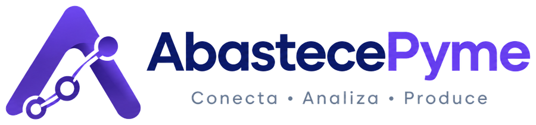
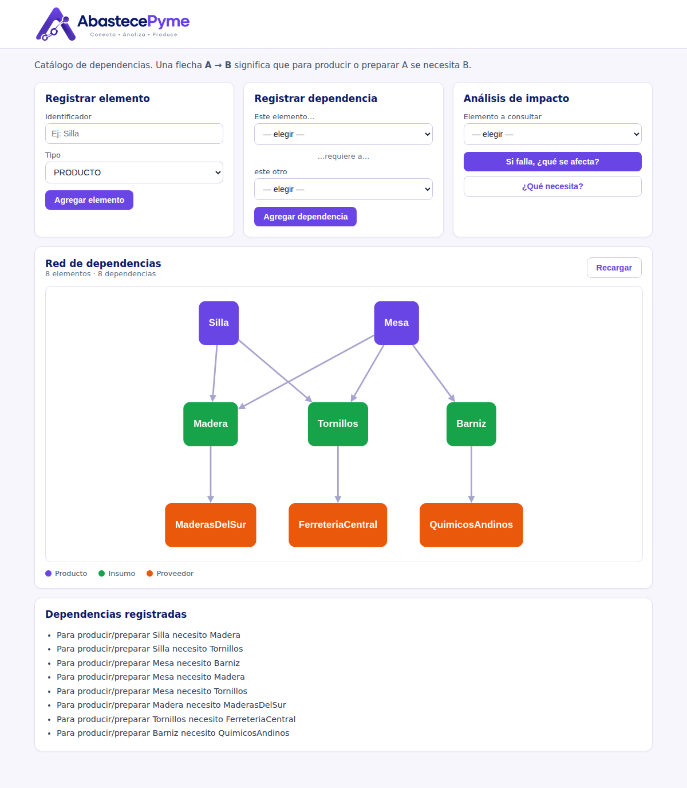
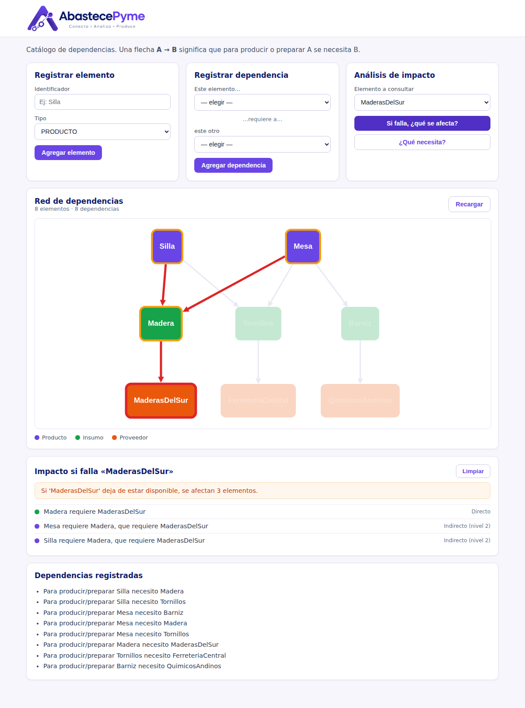
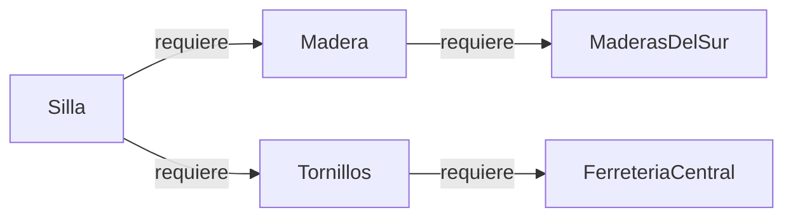

<p align="center">
  
</p>

# AbastecePyme — Catálogo de dependencias y análisis de impacto

AbastecePyme fabrica productos sencillos y depende de insumos y proveedores. Este
proyecto modela esa red de dependencias como un **grafo dirigido** para que el
equipo pueda registrarla, consultarla y, en las siguientes entregas, analizar qué
se afecta cuando algo falla.

Este README documenta la **Feature 1: catálogo de dependencias** y la **Feature 2: análisis de
impacto**.

- **Backend:** Python + FastAPI (`backend/`).
- **Frontend:** Angular + Cytoscape (`frontend/`).
- **Datos:** sintéticos y en memoria. No hay base de datos.

## Qué permite la Feature 1

| Requisito del brief | Cómo se cumple |
|---|---|
| Crear y listar elementos con tipo e identificador único | `POST` y `GET /api/elementos`. Tipos: `PRODUCTO`, `INSUMO`, `PROVEEDOR`. |
| Dependencias solo entre elementos válidos | `POST /api/dependencias` exige que origen y destino existan. |
| Validar relaciones repetidas y datos mal formados | Errores con código HTTP y `error_code` estables (ver más abajo). |
| Mostrar la red por API e interfaz mínima | `GET /api/red` y el grafo dibujado en el frontend. |
| Justificar dirección de aristas y representación | Secciones siguientes. |

## Qué permite la Feature 2

| Requisito del brief | Cómo se cumple |
|---|---|
| Consultar el impacto desde un proveedor o insumo, o hacia un producto | `GET /api/elementos/{id}/impacto` (qué se afecta si falla) y `GET /api/elementos/{id}/requisitos` (qué necesita un producto). |
| Recorrido propio, con elementos visitados comprensibles | Recorrido en anchura hecho a mano en `DirectedGraph`. Cada elemento trae su nivel, su cadena y una frase. |
| Diferenciar inexistente, sin dependencias y cadena | `404`, `SIN_IMPACTO` y `CON_IMPACTO` (ver abajo). |
| Explicar qué significa "alcanzar" | Sección siguiente. |

## Qué significa "alcanzar" en este negocio

Un elemento **X alcanza a Y** cuando existe una cadena de dependencias que va de X hasta Y
siguiendo las flechas: *X requiere … que requiere Y*. En AbastecePyme eso quiere decir que
**X no se puede producir o preparar sin Y**, aunque Y no sea un requisito directo.

La dirección de las aristas (`A → B`: A requiere B) decide el sentido de cada consulta, sin
condicionales en el código:

| Consulta | Pregunta del negocio | Recorrido |
|---|---|---|
| **Impacto** de X | Si X deja de estar disponible, ¿qué se afecta? | Contra las flechas: los elementos que alcanzan a X. |
| **Requisitos** de X | ¿Qué necesita X para producirse? | A favor de las flechas: los elementos que X alcanza. |

Por ejemplo, con `Silla → Madera → MaderasDelSur`, el impacto de `MaderasDelSur` incluye a
`Madera` (directo) y a `Silla` (indirecto, nivel 2). Los requisitos de `Silla` incluyen a
`Madera` y a `MaderasDelSur`.

Cada elemento alcanzado se reporta una sola vez, por su **camino más corto**, y trae:

- `nivel`: cuántos eslabones lo separan del consultado (1 es una relación directa).
- `cadena`: el camino, siempre escrito a favor de las flechas (cada elemento requiere al siguiente).
- `explicacion`: esa cadena en lenguaje natural, por ejemplo *"Silla requiere Madera, que requiere MaderasDelSur"*.

### Los tres casos que distingue la consulta

| Caso | Respuesta |
|---|---|
| El elemento **no existe** | `404` con `ELEMENTO_NO_ENCONTRADO`. |
| El elemento **no tiene dependencias en ese sentido** (nadie lo requiere, o no requiere nada) | `200` con `estado` `SIN_IMPACTO` (o `SIN_REQUISITOS`) y la lista vacía. |
| El elemento **afecta una cadena** (o la necesita) | `200` con `estado` `CON_IMPACTO` (o `CON_REQUISITOS`) y los elementos alcanzados. |

Una consulta sobre un elemento que existe pero no tiene dependencias no es un error: es una
respuesta válida ("su falta no afecta a nadie"). Por eso se separa del `404`.

### El recorrido

El recorrido es un **recorrido en anchura** (BFS) implementado en
`backend/domain/graph/directed_graph.py`, sin librerías de grafos:

- Usa una cola y un conjunto de visitados, así que cada nodo se procesa una vez: costo
  **O(V + E)**.
- **Termina aunque haya ciclos**, porque nunca vuelve a un nodo ya visitado. El elemento
  consultado nunca aparece en su propio resultado.
- Se eligió anchura y no profundidad porque entrega el camino más corto y ordena el resultado
  por cercanía: primero los afectados directos, que es como lo lee el coordinador de producción.
- Los vecinos se visitan en orden alfabético, así que el resultado es siempre el mismo.

Ejemplo de respuesta de `GET /api/elementos/MaderasDelSur/impacto`:

```json
{
  "consultado": { "id": "MaderasDelSur", "tipo": "PROVEEDOR" },
  "sentido": "IMPACTO",
  "estado": "CON_IMPACTO",
  "mensaje": "Si 'MaderasDelSur' deja de estar disponible, se afectan 3 elementos.",
  "total": 3,
  "alcanzados": [
    {
      "id": "Madera", "tipo": "INSUMO", "nivel": 1,
      "cadena": ["Madera", "MaderasDelSur"],
      "explicacion": "Madera requiere MaderasDelSur"
    },
    {
      "id": "Silla", "tipo": "PRODUCTO", "nivel": 2,
      "cadena": ["Silla", "Madera", "MaderasDelSur"],
      "explicacion": "Silla requiere Madera, que requiere MaderasDelSur"
    }
  ]
}
```

(El ejemplo omite `Mesa` por brevedad.)

## Interfaz

El frontend consume la API y dibuja la red con Cytoscape, con un diseño por niveles (dagre):
los productos quedan arriba y sus requisitos debajo, en el sentido de las flechas. Tiene
formularios para registrar elementos y dependencias, una tarjeta de **análisis de impacto**, la
leyenda de colores por tipo y la lista de dependencias en forma de frase.



Al consultar el impacto de un elemento, el grafo resalta el elemento que falla (borde rojo), los
elementos afectados (borde ámbar) y la cadena que los une (flechas rojas); el resto se atenúa.
Debajo se lista cada elemento afectado con su explicación. La consulta de requisitos hace lo
mismo en el sentido contrario.



## Dirección de las aristas

**Una arista `A → B` significa que A requiere a B.** Cada dependencia se expresa
con una frase completa, que la API devuelve en el campo `frase`:

> Para producir/preparar **Silla** necesito **Madera**.


```mermaid
graph LR
    Silla -->|requiere| Madera
    Silla -->|requiere| Tornillos
    Madera -->|requiere| MaderasDelSur
    Tornillos -->|requiere| FerreteriaCentral
```

**Por qué esta dirección.** La frase solo tiene sentido en un sentido. Invertida
("para producir Madera necesito Silla") es falsa, y el grafo debe reflejarlo en su
estructura y no con condicionales en el código. Además, la dirección se lee de
forma natural:

- los **sucesores** de un nodo son lo que ese elemento necesita (hacia los
  proveedores);
- los **predecesores** de un nodo son quienes dependen de él (hacia los
  productos).

Las siguientes entregas aprovechan esta lectura: saber qué se afecta cuando un
proveedor falla es recorrer la red hacia atrás, desde ese proveedor hacia quienes
lo requieren.

## Representación del grafo

La representación principal es una **lista de adyacencia** implementada a mano
(sin librerías de grafos) en `backend/domain/graph/directed_graph.py`:

- `_nodes`: diccionario `id → Node`, que conserva el orden de alta.
- `_successors`: diccionario `id → conjunto de ids que ese nodo requiere`.
- `_predecessors`: diccionario `id → conjunto de ids que requieren a ese nodo`.

Agregar una arista actualiza los dos índices en una sola operación, así que
nunca quedan desincronizados.

**Por qué no otra representación.** Una red de abastecimiento es *dispersa*: cada
producto depende de unos pocos insumos, no de todos los elementos.

| Representación | Memoria | ¿Existe la arista A→B? | Sucesores de un nodo |
|---|---|---|---|
| **Lista de adyacencia (elegida)** | O(V + E) | O(1) promedio | O(grado) |
| Matriz de adyacencia | O(V²) | O(1) | O(V) |
| Lista de aristas | O(E) | O(E) | O(E) |

- La **matriz** gasta memoria en celdas vacías y obliga a recorrer toda una fila
  para saber qué requiere un nodo.
- La **lista de aristas** haría lento validar duplicados y obtener vecinos, que es
  lo que más se usa.
- El índice de **predecesores** da la vista inversa sin recorrer el grafo entero.

**Orden determinista.** Los elementos se listan en orden de alta. Las aristas se
listan por nodo en orden de alta y, dentro de cada nodo, con destinos en orden
alfabético. Así la API y las pruebas dan siempre el mismo resultado.

## Reglas de negocio

**Identificador del elemento**

- Debe ser texto no vacío, de hasta 120 caracteres. Los espacios de los extremos
  se recortan.
- Es **único en todo el catálogo y no distingue mayúsculas**: `Madera` y `madera`
  son el mismo elemento. Un mismo id no puede ser a la vez insumo y proveedor.
- Se conserva el id tal como se registró por primera vez.

**Tipo del elemento:** `PRODUCTO`, `INSUMO` o `PROVEEDOR`. Se acepta en cualquier
combinación de mayúsculas y con espacios alrededor.

**Dependencias**

- Origen y destino deben existir.
- No se permite la **autodependencia** (un elemento que se requiere a sí mismo):
  es un dato mal formado.
- No se permite repetir una dependencia.
- No se restringe qué tipo puede depender de cuál: un insumo compuesto por otro
  insumo es un caso real.
- **Se permiten ciclos** (`A → B` y `B → A`). Es intencional: el cliente necesita
  detectar configuraciones imposibles, y esa detección es parte de una entrega
  posterior. Hoy el catálogo las registra sin juzgarlas.

## Arquitectura

```
backend/
├── main.py                     Arranque de FastAPI y CORS
├── api/                        Capa HTTP: rutas (catálogo e impacto), esquemas y errores
├── application/                Casos de uso (CatalogService)
├── domain/
│   ├── graph/                  Grafo dirigido genérico con recorridos, sin reglas de negocio
│   └── dependency_catalog/     Reglas de AbastecePyme sobre el grafo y consultas de alcance
├── infrastructure/             Repositorio en memoria
└── tests/                      Pruebas por capa

frontend/src/app/
├── app.ts / app.html / app.css  Pantalla principal: formularios, red y lista
├── Impacto/                    Resultado de la consulta de impacto
└── Graph/
    ├── graphView.ts            Dibujo del grafo con Cytoscape (diseño dagre)
    ├── models/                 Tipos que reflejan el contrato de la API
    └── services/               Cliente HTTP del backend
```

Las dependencias van siempre hacia adentro: `api → application → domain`.

- `domain/graph/` no sabe nada de productos ni proveedores. Es un grafo genérico
  reutilizable.
- `domain/dependency_catalog/` usa ese grafo y le suma las reglas del negocio.
- `CatalogRepository` es un puerto (clase abstracta) definido en el dominio. Hoy
  lo implementa `InMemoryCatalogRepository`; cambiar a una base de datos no
  tocaría el dominio ni los casos de uso.
- Los endpoints no validan reglas: solo traducen HTTP a casos de uso. Los errores
  de dominio se convierten en respuestas HTTP en un solo lugar (`api/errors.py`).

## API

Con el backend corriendo, la documentación interactiva está en
`http://localhost:8000/docs`.

| Método | Ruta | Descripción |
|---|---|---|
| `POST` | `/api/elementos` | Registra un producto, insumo o proveedor (201). |
| `GET` | `/api/elementos` | Lista los elementos en orden de alta. |
| `POST` | `/api/dependencias` | Registra que un elemento requiere a otro (201). |
| `GET` | `/api/dependencias` | Lista las dependencias con su frase. |
| `GET` | `/api/red` | Devuelve elementos, dependencias y totales juntos. |
| `GET` | `/api/elementos/{id}/impacto` | Qué se afecta si el elemento deja de estar disponible. |
| `GET` | `/api/elementos/{id}/requisitos` | Qué necesita el elemento, directa o indirectamente. |
| `GET` | `/health` | Comprueba que la API responde. |

Un catálogo vacío responde `200` con listas vacías, no `404`.

**Errores.** Todos tienen el mismo formato, también los de cuerpo mal formado:

```json
{
  "error_code": "ELEMENTO_NO_ENCONTRADO",
  "message": "El elemento 'Pata' no existe en el catálogo.",
  "details": { "id_elemento": "Pata" }
}
```

| `error_code` | HTTP | Cuándo |
|---|---|---|
| `ELEMENTO_NO_ENCONTRADO` | 404 | Origen o destino no existen. |
| `ELEMENTO_DUPLICADO` | 409 | El id ya está registrado (sin distinguir mayúsculas). |
| `DEPENDENCIA_DUPLICADA` | 409 | La dependencia ya existe. |
| `AUTODEPENDENCIA` | 422 | Origen y destino son el mismo elemento. |
| `TIPO_INVALIDO` | 422 | El tipo no es `PRODUCTO`, `INSUMO` ni `PROVEEDOR`. |
| `ID_INVALIDO` | 422 | Id solo con espacios o de más de 120 caracteres. |
| `CUERPO_INVALIDO` | 422 | Falta un campo, el id llega vacío o no es texto, o el JSON no tiene el formato esperado. |

## Cómo ejecutarlo

Requisitos: **Python 3.10 o superior** y **Node.js 22.22.3 o superior** (o 24.15+), que es lo que
exige Angular CLI.

**Backend** (puerto 8000)

```bash
cd backend
python -m venv venv
source venv/Scripts/activate      # Windows (Git Bash). En Linux/macOS: source venv/bin/activate
pip install -r requirements.txt
uvicorn main:app --reload
```

**Frontend** (puerto 4200), en otra terminal

```bash
cd frontend
npm install
npm start
```

Abre `http://localhost:4200`. El backend debe estar corriendo.

**Datos de demostración.** Los datos viven en memoria, así que el catálogo arranca
vacío cada vez que se reinicia el backend. Con el backend corriendo, en otra
terminal y con el entorno virtual activo:

```bash
cd backend
python scripts/cargar_demo.py
```

Carga 8 elementos y 7 dependencias sintéticas (sillas, mesas, insumos y
proveedores). Se puede ejecutar varias veces sin duplicar nada. Deja a propósito
sin registrar `Barniz → QuimicosAndinos`, para cargarla en vivo durante la demo.

## Pruebas

```bash
cd backend
pytest
```

Hay 202 pruebas automatizadas, organizadas por capa:

- `tests/domain/`: el grafo (nodos, aristas, vecindad y recorridos, incluidos ciclos y
  caminos múltiples) y las reglas del catálogo, con sus consultas de impacto y requisitos.
- `tests/application/`: los casos de uso, incluido que no se persiste cuando el
  dominio rechaza una operación.
- `tests/infrastructure/`: el contrato del repositorio en memoria.
- `tests/api/`: los endpoints, códigos HTTP y formato de error, incluidos los tres casos de
  la consulta de impacto.

## Cómo está preparado para crecer

Las entregas se apoyan en lo que ya existe, sin reescribirlo. La Feature 2 lo muestra: el
impacto y los requisitos son dos recorridos nuevos sobre el mismo grafo, sin cambiar el modelo.

- Los análisis nuevos se agregan como algoritmos sobre `DirectedGraph`, que ya
  expone sucesores, predecesores y recorridos.
- Cada caso de uso nuevo es un método de `CatalogService`.
- Cada error nuevo es una línea en la tabla `MAPEO_ERRORES` de `api/errors.py`.
- El frontend ya consume un contrato de error único.
